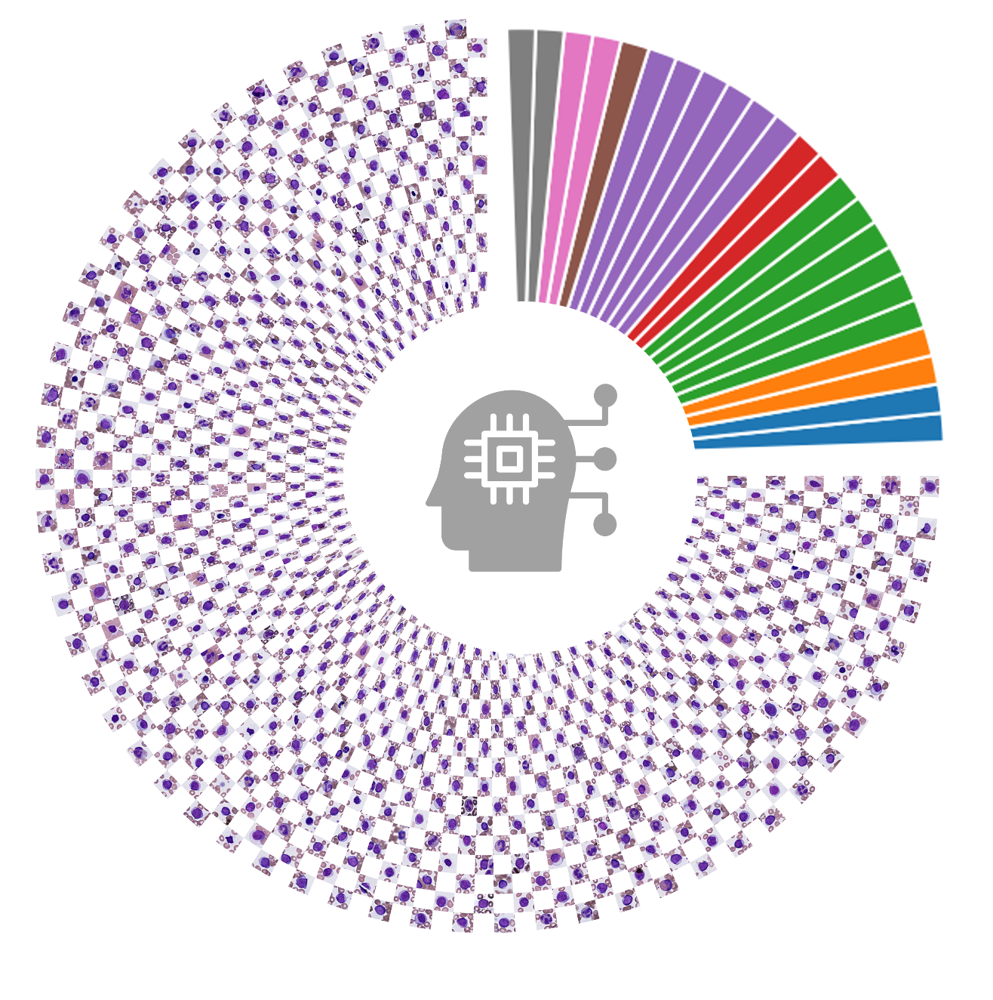

<div align="center">
    
</div>

<div align="center">
    <h1>DeepHeme: A High-Performance, Generalizable, Deep Ensemble for Bone Marrow Morphometry and Hematologic Diagnosis</h1>
</div>

## Overview
DeepHeme is a state-of-the-art deep learning framework designed for bone marrow morphometry analysis and hematologic diagnosis. This repository contains the implementation of our deep ensemble approach, which combines multiple models to achieve robust and accurate results in hematologic image analysis.

## Features
- High-performance deep ensemble architecture
- Support for both regular training and snapshot ensemble approaches
- Flexible data preparation pipeline
- Compatible with ImageFolder-style datasets
- Configurable training parameters
- Support for multiple pre-trained models

## Installation

1. Clone the repository:
```bash
git clone https://github.com/HarrySSH/DeepHeme.git
cd DeepHeme
```

2. Install dependencies:
```bash
pip install -r requirements.txt
```

## Usage

### Data Preparation

The framework requires a structured dataset with proper train/validation/test splits. The data preparation process involves creating a CSV file containing image paths, labels, and split information.

1. Prepare your dataset in an ImageFolder-compatible structure
2. Configure the data preparation script:
   - Open `Data_preparation.py`
   - Set `image_collect_root_dir` to your dataset root directory
3. Run the data preparation script:
```bash
python Data_preparation.py
```

The script will generate a CSV file with the following columns:
- `fpath`: Path to the image file
- `label`: Class label
- `split`: Dataset split (train/val/test)

### Training

The framework supports two training approaches:

#### 1. Regular Training
```bash
python main.py [options]
```

#### 2. Snapshot Ensemble
```bash
python main_se.py [options]
```

### Configuration Options

Both training scripts support the following command-line arguments:

| Argument | Type | Default | Description |
|----------|------|---------|-------------|
| `--meta_data` | str | 'data_info.csv' | Path to the metadata CSV file |
| `--input_model` | str | 'ResNeXt50' | Model architecture to use |
| `--pretrained` | bool | True | Whether to use pre-trained weights |
| `--init_lr` | float | 0.001 | Initial learning rate |
| `--weight_decay` | float | 0.0005 | Weight decay for regularization |
| `--gamma` | float | 0.1 | Learning rate decay factor |
| `--epochs` | float | 100 | Number of training epochs |
| `--batch_size` | int | 1024 | Batch size for training |
| `--lr_decay_every_x_epochs` | int | 10 | Learning rate decay interval |
| `--save_checkpoints_dir` | str | None | Directory to save model checkpoints |

### Supported Models
The framework supports the following pre-trained models:
- ResNeXt50 (default)
- GoogleNet
- Inception_v3
- VGG19
- EfficientNet_v2
- ResNet50
- ResNet101
- AlexNet

### Data Augmentation
The framework includes comprehensive data augmentation pipelines:

#### Training Augmentation
- Random rotation and scaling
- Horizontal and vertical flips
- Affine transformations
- ISO noise
- Brightness and contrast adjustments
- CLAHE
- Color jittering
- Random gamma
- Normalization

#### Validation Augmentation
- Normalization only

## Citation

If you use this code in your research, please cite our work:

```bash
Sun, S., Yin, Z., Van Cleave, J. G., Wang, L., Fried, B., Bilal, K. H., Lucas, F., Isgor, I. S., Webb, D. C., Singi, S., Brown, L., Shouval, R., Lin, J., Yan, E. S., Spector, J. D., Ardon, O., Boiocchi, L., Sardana, R., Baik, J., Zhu, M., Syed, A., Yabe, M., Lu, C. M., Roshal, M., Vanderbilt, C., Goldgof, D. B., Dogan, A., Prakash, S., Carmichael, I., Butte, A. J., & Goldgof, G. M. (2025). DeepHeme, a high-performance, generalizable deep ensemble for bone marrow morphometry and hematologic diagnosis. Science Translational Medicine, 17(802), eadq2162. https://doi.org/10.1126/scitranslmed.adq2162
```